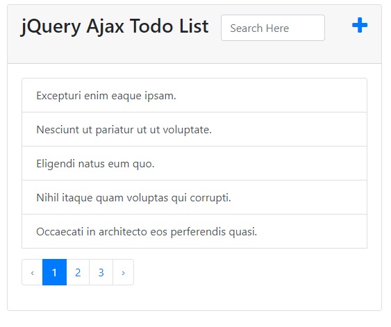
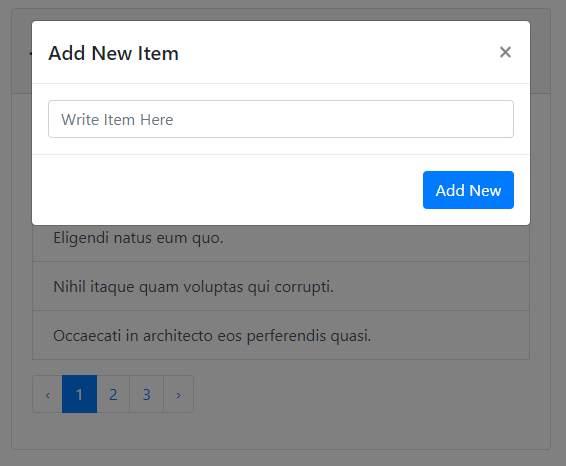
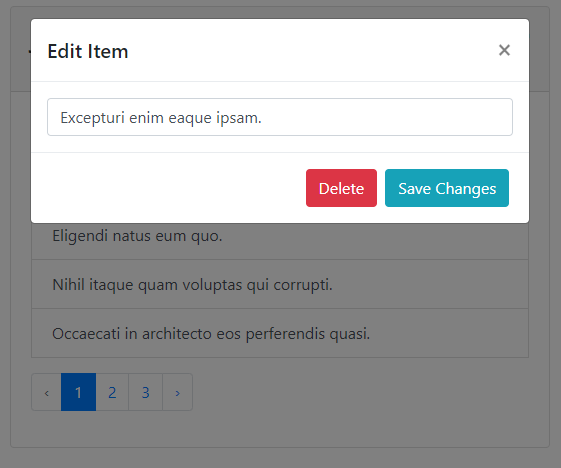
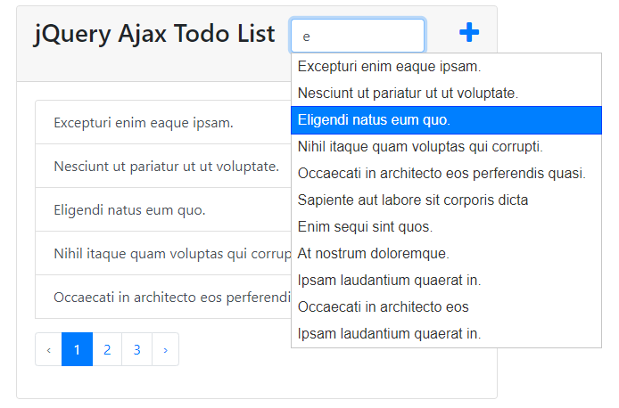
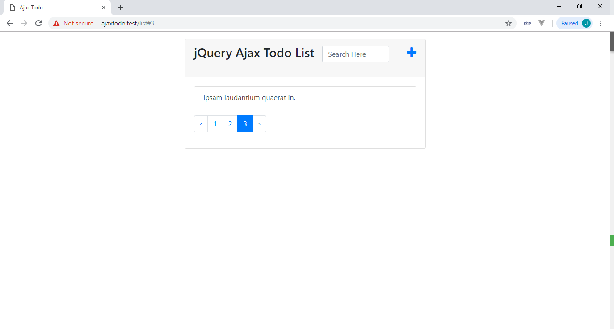

<p align="center"></p>
<p align="center"></p>
<p align="center"></p>
<p align="center"></p>
<p align="center"></p>
<p align="center"></p>

## We are going to use Laravel and  jQuery

## Installation

Clone this repository

```bash
git clone https://github.com/imsat/ajaxtodo.git
```

Go inside the directory

```bash
cd ajaxtodo
```

Now install composer

```bash
composer install
```

Generate key on .env file

```bash
cp .env.example .env
php artisan key:generate
```


## License

The Laravel framework is open-source software licensed under the [MIT license](https://opensource.org/licenses/MIT).
